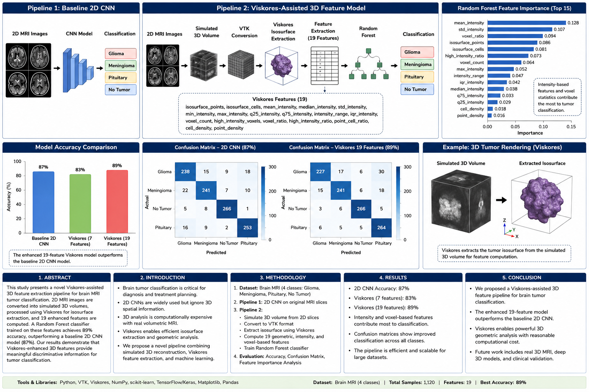

# Cancer Viskores Project

Brain MRI tumor classification comparing a baseline 2D CNN model with a Viskores-assisted simulated 3D feature extraction pipeline.

## Workflow


## Pipelines

### Pipeline 1: Baseline 2D CNN
2D MRI images are used directly to train a CNN classifier.

### Pipeline 2: Viskores-Assisted 3D Feature Model
2D MRI images are converted into simulated 3D volumes. Viskores is used for isosurface extraction, and enhanced 3D/intensity features are used with a Random Forest classifier.

## Current Results

| Model | Accuracy |
|---|---:|
| Baseline 2D CNN | 87% |
| Viskores 3D Features + Random Forest | 89% |

## How to Run

```bash
source venv/bin/activate
python3 scripts/train_2d_cnn.py
python3 scripts/volume_generation/create_3d_volumes.py
python3 scripts/volume_generation/convert_npy_to_vtk.py
./scripts/run_viskores_all.sh
python3 scripts/extract_enhanced_features.py
python3 scripts/train_viskores_feature_model.py

### 4. Create requirements file

```bash
pip freeze > requirements.txt

### 5. Workflow


